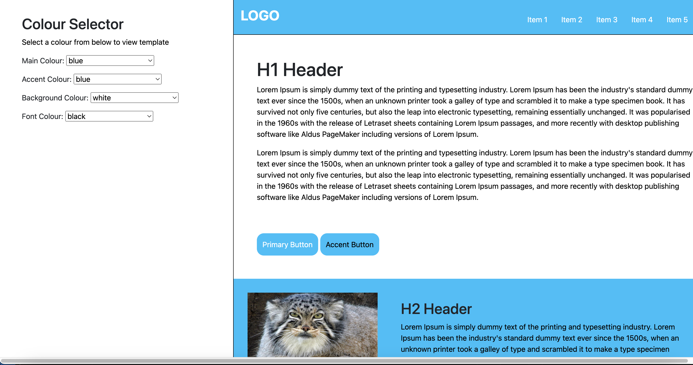

# Website Template Editor by Da Dawgs



## Info

This project was made for learning as a Friday Group Project during the Dev Academy Bootcamp. This app was made my Adam, Andrew, Jaelyn and Quinn. The goal of this app was to allow a user to select different colours to change aspects of the site. The was accomplished with vanilla JavaScript editting HTML elements styles.

## Setup

```
npm i 
npm run knex migrate:latest
npm run knex mseed:run
npm run dev
```

### What's included

 - Express
 - Knex
 - SQLite3
 - Express Handlebars
 - body-parser
 - Jest
 - nodemon
